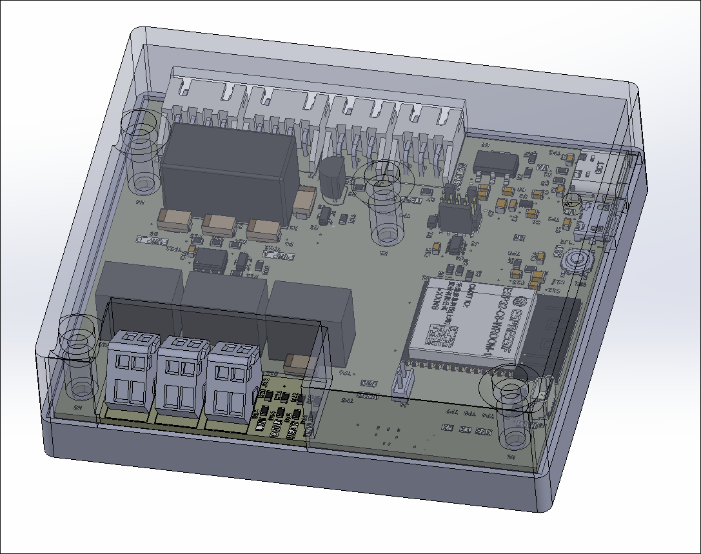
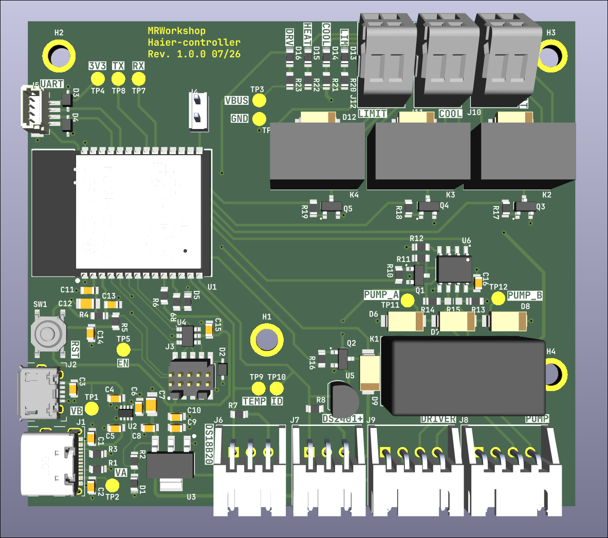

# Haier Heat Pump Controller

Custom controller and monitoring interface for Haier heat pumps using the **YR-E27 remote-control interface / Modbus RTU**.

The project combines an embedded controller, custom hardware, firmware, and host-side tools for communicating with and monitoring the heat pump.



## Overview

The controller interfaces directly with the heat pump's communication bus and provides access to operational data and control parameters that are otherwise handled by the original control system.

The system is built around an **ESP32-C6** running **Zephyr RTOS**. The controller communicates with the heat pump over UART/Modbus RTU and exposes selected telemetry and control functionality through Wi-Fi and MQTT.

The repository also contains hardware and mechanical design files, as well as software utilities used for protocol investigation, testing, and monitoring.

## System Architecture

```text
                    ┌─────────────────────┐
                    │    Haier Heat Pump  │
                    │                     │
                    │  YR-E27 / Modbus RTU│
                    └──────────┬──────────┘
                               │
                         UART / RS-485
                               │
                    ┌──────────▼──────────┐
                    │   ESP32-C6          │
                    │                     │
                    │   Zephyr RTOS       │
                    │   Modbus client     │
                    │   Heat pump driver  │
                    │   Control logic     │
                    └───────┬───────┬─────┘
                            │       │
                          Wi-Fi    GPIO
                            │       │
                     ┌──────▼───┐   ├── Relay outputs
                     │   MQTT   │   └── Status / sensors
                     └──────────┘
```

The exact hardware interfaces and signal routing are documented in the hardware design files.

## Heat Pump Communication

The main purpose of the project is direct communication with the Haier heat pump.

Communication uses **Modbus RTU over UART**. The firmware implements the required register access and translates the heat pump's register data into higher-level operating parameters.

The implementation currently provides access to parameters including:

* CH temperature
* DHW temperature
* CH target temperature
* DHW target temperature
* Operating mode
* Valve state
* Tank status
* Heater operating state
* Other system status registers

The firmware can also write supported registers to change selected operating parameters.

The register definitions and protocol implementation are located in the firmware sources.

## Hardware



The controller is based on an **ESP32-C6**.

The hardware provides interfaces for:

* Heat pump communication
* Wi-Fi
* Temperature measurement
* Relay/control outputs
* Status indication

The complete hardware design is located in [`hw/`](./hw).

Refer to the schematics and PCB files there for the actual electrical implementation.

## Mechanical Design

Mechanical parts and enclosure designs are located in [`hwm/`](./hwm).

The enclosure is designed around the controller hardware and its intended installation environment.

Available CAD/manufacturing files should be treated as the authoritative source for dimensions and mechanical details.

## Firmware

The embedded firmware is located in [`fw/`](./fw).

It is written in **C** and uses **Zephyr RTOS**.

The firmware is responsible for:

* Modbus communication with the heat pump
* Register decoding
* Heat pump state/control handling
* Wi-Fi connectivity
* MQTT communication
* Telemetry publishing
* Local I/O such as relays and sensors

The main application and hardware-specific code are organized within the firmware tree.

## MQTT

The controller publishes heat pump telemetry over MQTT, allowing the data to be consumed by external systems such as home-automation or monitoring software.

Telemetry is encoded using **CBOR** before being published.

The MQTT interface is implemented in the firmware and is intended to decouple the heat pump interface from higher-level monitoring and automation systems.

## Host-Side Tools

The [`sw/`](./sw) directory contains software used during development and operation of the system.

These tools are separate from the ESP32 firmware and are useful for tasks such as:

* Monitoring communication
* Testing the heat pump interface
* Experimenting with the protocol
* Simulating heat pump behavior

In particular, `sniffer.py` and `mock_heatpump.py` are used for working with the communication protocol without necessarily relying on the complete embedded system.

## Building the Firmware

The firmware uses the Zephyr build system and `west`.

Initialize the project:

```bash
./init.sh
```

Build for the target board:

```bash
west build -p auto -b esp32c6_devkitc_hpcore
```

Flash the resulting firmware:

```bash
west flash
```

The required Zephyr SDK and Python dependencies must be installed before building.

## Repository Structure

```text
.
├── fw/                  # ESP32-C6 firmware
│   ├── src/             # Application code
│   ├── drivers/         # Hardware / heat pump drivers
│   └── boards/          # Board-specific configuration
│
├── hw/                  # Electronics design
│   ├── ...              # Schematics / PCB files
│   └── ...
│
├── hwm/                 # Mechanical design
│   ├── ...              # CAD / STL files
│   └── ...
│
├── sw/                  # Host-side tools
│   ├── sniffer.py       # Protocol analysis tool
│   ├── mock_heatpump.py # Heat pump simulator
│   └── ...
│
└── README.md
```

## Development Status

This repository contains an actively developed controller and reverse-engineering effort for interfacing with the Haier heat pump communication system.

The firmware, hardware, and host-side tooling are maintained together because development of the controller depends on understanding and testing the heat pump's communication protocol.

For the current implementation status, refer to the firmware and software sources rather than assuming that every documented interface is production-ready.

